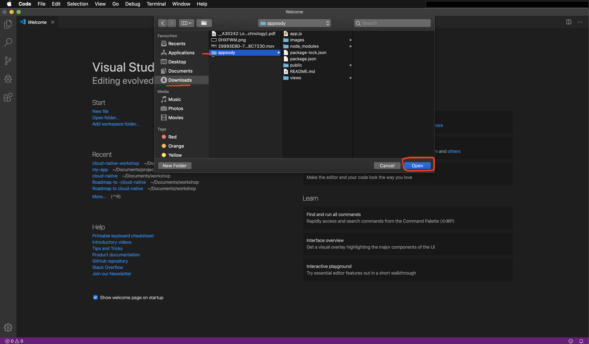
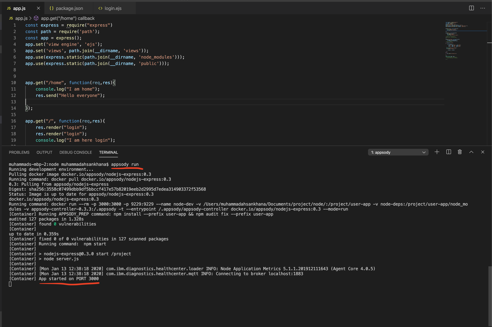

# Do local development, containerize and migrate to Docker Hub using Appsody

In this tutorial, I show you how to use a new open source project, Appsody, to create an application locally and then build and deploy that application to a Docker Hub so you can use it on any cloud or platform that supports Docker images. After completing this tutorial, you will see how Appsody enables you to containerize a Node.js Express application without having to be an expert in container technology. 

## Prerequisites

To complete the steps in this tutorial, you need to:
1. [Install Docker](https://docs.docker.com/install/) on your local machine.
2. Install VS code [Visual Studio Code](https://code.visualstudio.com/) for local development.

## Steps
1.	[Clone the application](#1-clone-the-application)
2.	[Open the application in Visual Code](#2-open-the-application-in-visual-code)
3.	[Install Appsody on your local machine](#3-install-appsody)
4. [Initialize Appsody in your project]((#4-initialize-appsody-in-your-project))
5.	Change the application on your local machine
6.	Build and deploy the application to Docker Hub

# 1-clone-the-application

1.	I'll show you the steps in this tutorial using an application in this  [GitHub repo](https://github.com/mahsankhaan/appsody.git)
2.	Open your terminal and change your directory by using command **cd downloads** .( Or any other directory in which you want to      clone the project)
3.	Run command **git clone https://github.com/mahsankhaan/appsody.git**   

# 2-open-the-application-in-visual-code

1. In this step we assume you have ready installed [Visual Studio Code](https://code.visualstudio.com/) ,if not please do that.
2.	Once Visual Studio Code is installed , open the application that we cloned. 

# 3-install-appsody

Kindly note. Below steps are for **macOS** , if you are on different OS please visit [here](https://appsody.dev/docs/getting-started/installation) for more details.

1. Open your terminal and follow bellow steps:

2.	If you don’t have **Homebrew** installed on your system , install it by running this command:
**"/usr/bin/ruby -e "$(curl -fsSL https://raw.githubusercontent.com/Homebrew/install/master/install)"**

3.	If you have Homebrew then install it by running : 
**brew install appsody/appsody/appsody**

4.	To check if Appsody is installed successfully use command **appsody list** in the terminal and you must be able to see the available templates.

# 4-initialize-appsody-in-your-project

Before initializing appsody , there are few concepts that needs to be understand: 
1. **Stack :**  Appsody uses a already made runtimes and frameworks , such as Java with Eclipse and Node.js with Express.
2. **Template :**  Provide a starting point for application development  and you can customize project templates and share them across teams.
3. **Repo:** They are categorized as stable(Tested and support all appsody command), incubator(Actively being worked on) or experimental( Experimental stacks are not being actively worked on) depending on the  content of the stack.

for more  details check [here](https://appsody.dev/docs/stacks/stacks-overview/)

**Steps to initialize appsody:**
1.	Open your Visual Studio Code , and use ctrl + shift + `to access CLI from your VS code.
2.	From the CLI, enter **appsody list** to view all the available Appsody stacks.
3.	Review the list of stacks and find one that closely resembles your existing project. 
4. The sample application in this tutorial is a **Node.js Expres app**, so we select that.

5.	Run **appsody init** command to initialize template.
   -appsody init <repo>/<stack> <template> 
   -appsody init incubator/nodejs-express none

**NOTE**
We use **“none”** in above template because we are initializing appsody in existing project , if you have your own code and want to initialize from the start then use  **appsody init incubator/nodejs-express simple**

 .Run Appsody init command to create the templete
 .Once the templete is successfully intailized , there will be  ".appsody-config.yml" created.

## Step 5: Let's do some local development

When a source code project is initialized with Appsody, you get a local Appsody development container. "Appsody run" starts the development container in run mode in the foreground. Appsody watches your local project directory for file changes and updates the application to reflect code changes as you develop.

Our container is running on PORT 3000.

## Step 6: Now it's time to build and deploy our application on Docker Hub
When we've finished the local development work for our Appsody project,we will containeried our application and upload it on Docker Hub, so that we can easily deploy it to a suitable runtime infrastructure such as IBM cloud platform or any other.

1. We will use the "appsody build" command to generate a deployment Docker image without writing any dockerfile.

2.Once your image is successfully built , we will be able to see "app-deploy.yml".

3. Run "docker images" command and see your image is created on your local machine.

4. Let's login into Docker Hub and create a new repository.

5. Finally push the image to Docker Hub and access the image any where .

6 . Check your local image is successfully uploaded to your Docker Registry.In the future you can pull the image any anywhere by using "docker pull ahsanoffical/appsody:testing" command.

 

